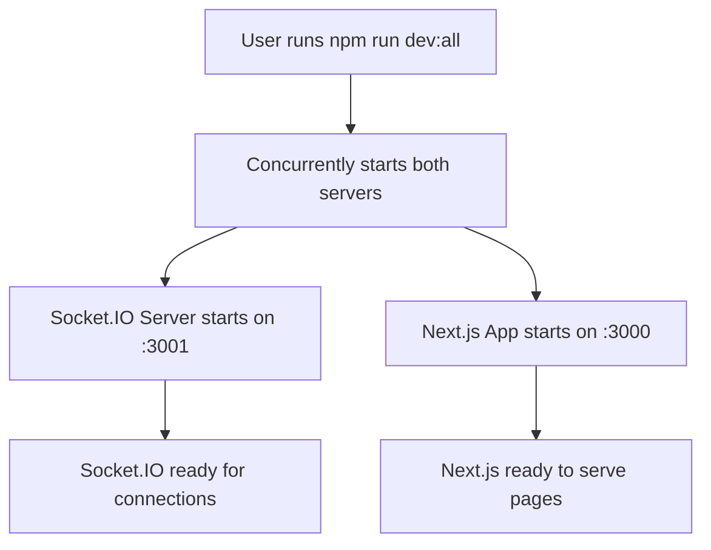
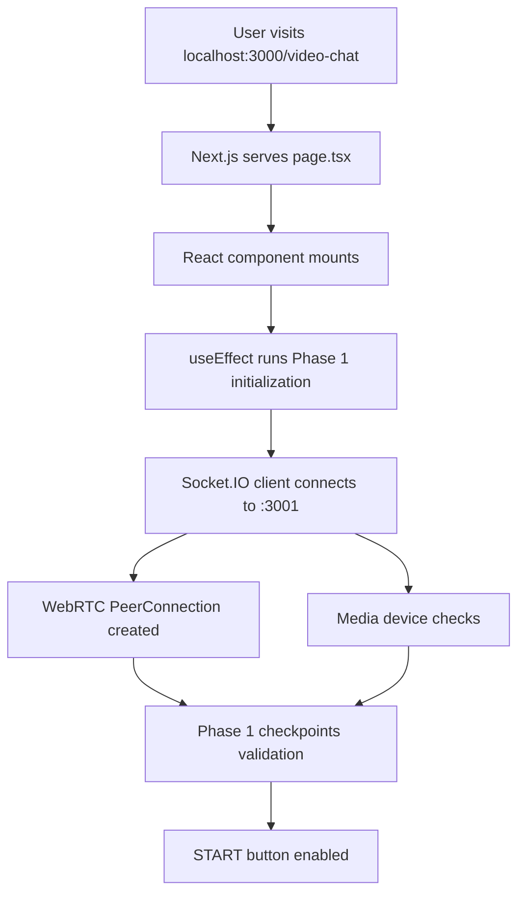
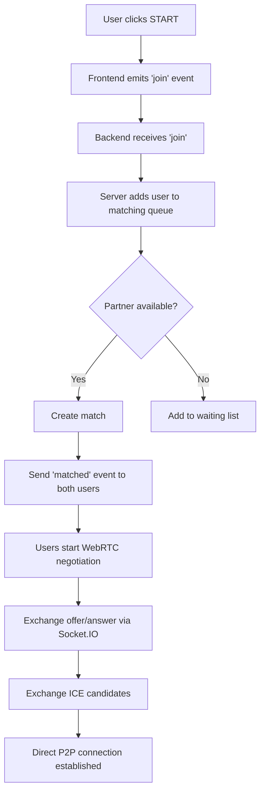

# 🏗️ Application Architecture & Code Flow Guide

## 🚀 **How to Start the Application**

### **Method 1: Both Servers Together (Recommended)**

```bash
npm run dev:all
```

### **Method 2: Separate Terminals**

```bash
# Terminal 1: Socket.IO Server
npm run dev:socket

# Terminal 2: Next.js App
npm run dev
```

### **If You Get Port Errors:**

```bash
# Check what's using port 3001
netstat -ano | findstr :3001

# Kill the process (replace PID with actual number)
taskkill /f /pid [PID_NUMBER]

# Or kill all Node.js processes
taskkill /f /im node.exe
```

## 🌐 **Port Architecture**

### **Port 3000: Next.js Frontend**

- **Purpose**: Serves the React/Next.js application
- **URL**: `http://localhost:3000`
- **What it does**:
  - Renders the UI components
  - Handles authentication
  - Manages client-side state
  - Connects to Socket.IO server

### **Port 3001: Socket.IO Backend**

- **Purpose**: WebRTC signaling and real-time communication
- **URL**: `http://localhost:3001`
- **What it does**:
  - Manages user connections
  - Handles WebRTC signaling (offer/answer/ICE)
  - User matching and queuing
  - Real-time messaging

## 📁 **File Structure & Code Flow**

### **Frontend Files (Next.js - Port 3000)**

```
src/
├── app/
│   ├── video-chat/
│   │   └── page.tsx           ← Main video chat interface
│   ├── auth/                  ← Authentication pages
│   ├── globals.css            ← Global styles
│   └── layout.tsx             ← App layout
│
├── components/
│   ├── SessionProvider.tsx   ← NextAuth session management
│   └── PhaseOneDebugger.tsx  ← Debug tools
│
├── lib/
│   ├── auth.ts               ← NextAuth configuration
│   └── mongodb.ts            ← Database connection
│
└── models/
    └── User.ts               ← User data model
```

### **Backend Files (Socket.IO - Port 3001)**

```
server.js                     ← Standalone Socket.IO server
```

## 🔄 **Complete Code Flow Explanation**

### **Phase 1: Application Startup**



#### **1. Server Startup (server.js)**

```javascript
// Creates HTTP server
const httpServer = createServer()

// Attaches Socket.IO
const io = new Server(httpServer, { cors: {...} })

// Listens on port 3001
httpServer.listen(3001)
```

#### **2. Next.js Startup**

```javascript
// Next.js automatically starts on port 3000
// Serves the React application
// Handles routing, authentication, etc.
```

### **Phase 2: User Accesses Application**



#### **3. Frontend Initialization (page.tsx)**

```javascript
// 1. Import Socket.IO client
import { io, Socket } from "socket.io-client";

// 2. Create connection to backend
socketRef.current = io("http://localhost:3001");

// 3. Set up event listeners
socketRef.current.on("connect", () => {...});
socketRef.current.on("connection-validated", () => {...});

// 4. Initialize WebRTC
peerConnectionRef.current = new RTCPeerConnection(rtcConfig);

// 5. Check media devices
navigator.mediaDevices.enumerateDevices();
```

### **Phase 3: Real-time Communication Flow**



## 🎯 **Key Components Explained**

### **1. Authentication System**

```javascript
// lib/auth.ts - NextAuth configuration
// Handles Google OAuth, session management
// Protects video chat routes

// middleware.ts - Route protection
// Redirects unauthenticated users
```

### **2. Socket.IO Communication**

```javascript
// Frontend: Connects to backend
const socket = io("http://localhost:3001");

// Backend: Handles events
io.on("connection", (socket) => {
  socket.on("join", handleJoin);
  socket.on("offer", forwardOffer);
  socket.on("answer", forwardAnswer);
  socket.on("ice-candidate", forwardICE);
});
```

### **3. WebRTC Setup**

```javascript
// Frontend: Creates peer connection
const pc = new RTCPeerConnection({
  iceServers: [{ urls: "stun:stun.l.google.com:19302" }],
});

// Signaling through Socket.IO
pc.createOffer().then((offer) => {
  socket.emit("offer", offer);
});
```

### **4. State Management**

```javascript
// React state for connection tracking
const [connectionState, setConnectionState] = useState({
  socket: "disconnected",
  webrtc: "not_initialized",
  media: "not_ready",
  queue: "not_in_queue",
});

// Phase 1 checkpoint system
const [phase1Checkpoints, setPhase1Checkpoints] = useState({
  socketConnection: false,
  webrtcInitialized: false,
  // ... 15 total checkpoints
});
```

## 🔍 **Debug System Architecture**

### **Two-Level Debugging:**

#### **1. Main Debug Panel (page.tsx)**

- Shows real-time connection states
- Displays all 15 Phase 1 checkpoints
- Progress bar and validation status
- "Force Validate" button for manual testing

#### **2. Test Suite (PhaseOneDebugger.tsx)**

- Independent validation system
- Manual testing capabilities
- Isolated component testing
- "Run Test" button for comprehensive checks

## 📊 **Data Flow Diagram**

```
User Browser (Port 3000)
     ↕️ HTTP/WebSocket
Next.js Server (Port 3000)
     ↕️ Socket.IO Client
Socket.IO Server (Port 3001)
     ↕️ WebRTC Signaling
Other User Browser
     ↕️ Direct P2P (WebRTC)
User Browser (No server needed)
```

## 🚨 **Common Issues & Solutions**

### **Port Already in Use**

```bash
# Problem: EADDRINUSE error
# Solution: Kill existing processes
taskkill /f /im node.exe
# Then restart: npm run dev:all
```

### **Socket Connection Failed**

```bash
# Check if Socket.IO server is running
curl http://localhost:3001
# Should return: "Socket.IO Server is running!"
```

### **Phase 1 Checkpoints Not Completing**

```javascript
// Use the "Force Validate" button in debug panel
// Check browser console for detailed logs
// Try the "Run Test" in Phase 1 Test Suite
```

### **Media Permissions**

```javascript
// Browser will prompt for camera/microphone access
// Allow permissions for Phase 1 to complete
// Some browsers require HTTPS (localhost is exception)
```

## 🎯 **What to Look For When Testing**

### **1. Server Startup**

```
✔ Socket.IO server ready on http://localhost:3001
✔ Next.js ready on http://localhost:3000
```

### **2. Phase 1 Debug Panel**

```
✔ All connection states: connected/initialized/ready
✔ All 15 checkpoints marked with ✔
✔ "Phase 1 Complete: ✔"
✔ START button turns green
```

### **3. Browser Console**

```
✔ Socket connected: [socket-id]
✔ WebRTC PeerConnection initialized
✔ Media devices available
✔ Connection validated
```

### **4. No Errors**

```
❌ No CORS errors
❌ No connection failures
❌ No permission denials
❌ No port conflicts
```

## 🚀 **Next Steps After Phase 1**

1. **Phase 2**: Implement START button functionality
2. **Phase 3**: Add partner matching and connection
3. **Phase 4**: Handle active video/audio streams
4. **Phase 5-7**: NEXT button, disconnection handling, STOP functionality

The architecture is designed to be modular and scalable, making it easy to add the remaining phases while maintaining the robust debugging system we've built!
